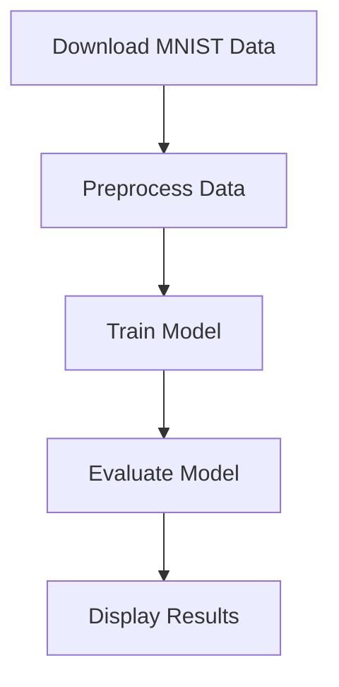
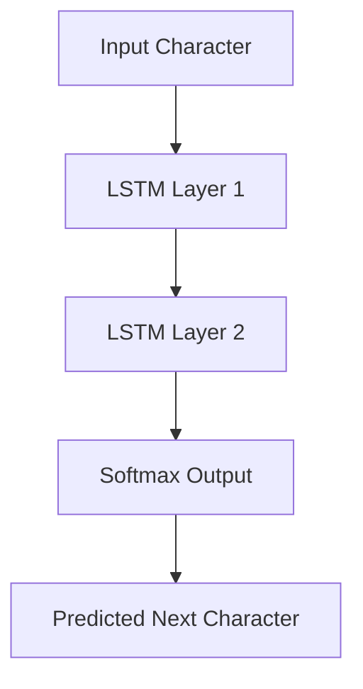
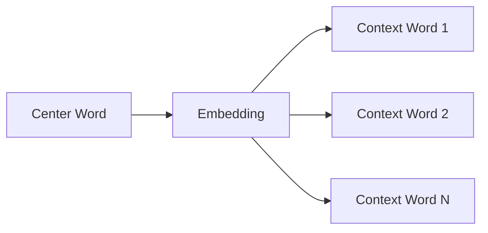

This project demostrate how to implement AI application with ZIO 2 and Deeplearning4j.

- [Human Speech Recognition Using Classification](#Human Speech Recognition Using Classification)
- [ImageProcessingUsingRNN](#ImageProcessingUsingRNN)
- [Natural Language Modeling Projects](#Natural Language Modeling Projects)
---

# Human Speech Recognition Using Classification

This project demonstrates how to implement a speech recognition system for sentiment analysis using deep learning techniques, specifically employing **LSTM** (Long Short-Term Memory) networks for text classification. The model is trained on the IMDB movie reviews dataset and uses word embeddings from Google News vectors to convert text into a format that a neural network can process.

## Overview

The `HumanSpeechRecognitionUsingClassification` is a sentiment analysis system built using **Deep Learning for Java (DL4J)** and **Apache Commons IO**. The process involves the following steps:

1. **Download and Prepare Data**: The IMDB reviews dataset is downloaded, unpacked, and prepared for training.
2. **Word Vectorization**: The Google News Word2Vec model is used to convert text reviews into word vectors.
3. **Neural Network Model Setup**: A Recurrent Neural Network (RNN) with LSTM layers is used for text classification.
4. **Training**: The model is trained on the training data for a specified number of epochs.
5. **Evaluation and Prediction**: The trained model is evaluated on test data, and predictions are generated for a sample review.

## Architecture

The system consists of the following key components:

### 1. **Data Download and Preparation**

The IMDB dataset is downloaded and extracted from a `.tar.gz` file. The dataset consists of movie reviews labeled as **positive** or **negative**. Each review is processed into a series of word vectors using the **Google News Word2Vec** model.

- **Word2Vec** transforms words into high-dimensional vectors that capture semantic meanings. Each word is represented by a 300-dimensional vector (size defined by the Google News model).

### 2. **Word Vectorization**

Each review is transformed into a sequence of word vectors (embeddings). These embeddings represent the semantic relationships between words, and they are input into the LSTM-based neural network.

### 3. **Neural Network Design**

The network consists of:

- **Input Layer**: Accepts the word vectors for each review.
- **LSTM Layer**: A type of Recurrent Neural Network (RNN) that captures temporal dependencies in the input sequence.
- **Output Layer**: A softmax layer with two outputs representing the probability of the review being **positive** or **negative**.

The neural network architecture is as follows:

1. **LSTM Layer**:
    - Input: 300-dimensional word vectors (Google News embeddings).
    - Output: 256 neurons.
    - Activation: Tanh.

2. **Output Layer**:
    - Input: 256 neurons from LSTM.
    - Output: 2 neurons (positive and negative sentiment).
    - Activation: Softmax (for classification).

### 4. **Training and Evaluation**

The model is trained using the **Adam optimizer** with a learning rate of `5e-3` and a **cross-entropy loss function**. After training, the model is evaluated on a test set using the `Evaluation` class from DL4J.

### 5. **Prediction**

After training, the system predicts the sentiment of a sample review. It outputs the probability of the review being **positive** or **negative**.

---

## Mathematical Foundation

### Word Embeddings (Word2Vec)

The **Word2Vec** model represents words as vectors in a continuous vector space. The embedding vectors capture semantic relationships between words based on their contexts in large corpora.

Let \( W = \{w_1, w_2, ..., w_n\} \) be a set of words in a vocabulary. The **Word2Vec** model learns a vector representation \( v(w) \in \mathbb{R}^d \) for each word \( w \), where \( d \) is the dimensionality of the embedding (in this case, 300).

The key objective is to minimize the distance between vectors of words that appear in similar contexts and maximize the distance for words that appear in different contexts. This is typically done using a **skip-gram** or **CBOW (Continuous Bag of Words)** model.

### LSTM Network

An LSTM (Long Short-Term Memory) is a type of RNN designed to learn long-range dependencies. It helps to mitigate the **vanishing gradient problem** often encountered with vanilla RNNs.

The LSTM operates as follows:

- **Forget Gate**: Decides what information should be discarded from the cell state.

  \[
  f_t = \sigma(W_f \cdot [h_{t-1}, x_t] + b_f)
  \]

- **Input Gate**: Determines what new information should be stored in the cell state.

  \[
  i_t = \sigma(W_i \cdot [h_{t-1}, x_t] + b_i)
  \]

- **Cell State Update**: Updates the cell state.

  \[
  C_t = f_t \cdot C_{t-1} + i_t \cdot \tilde{C}_t
  \]

- **Output Gate**: Determines the output of the LSTM cell.

  \[
  o_t = \sigma(W_o \cdot [h_{t-1}, x_t] + b_o)
  \]

  \[
  h_t = o_t \cdot \tanh(C_t)
  \]

### Softmax Layer

The **softmax** function is used to convert the outputs into probabilities, ensuring that the sum of the predicted probabilities equals 1:

\[
p(y = 1 | x) = \frac{e^{z_1}}{e^{z_1} + e^{z_2}}
\]
Where \( z_1 \) and \( z_2 \) are the raw scores (logits) for the two classes (positive and negative).

---

## Diagram of the Architecture

Here’s a simple diagram to represent the architecture of the system:

```plaintext
Input Review Text → [Word2Vec Embedding] → LSTM Layer → Softmax Layer
                                             ↓
                                   Predicted Sentiment
                                (Positive/Negative)

```
---
# ImageProcessingUsingRNN

This document provides an overview and guide for the ImageProcessingUsingRNN project. It demonstrates how to use a neural network to perform image classification on the MNIST dataset using ZIO for effect handling and DeepLearning4J (DL4J) for machine learning.

## Features

- Downloads and extracts the MNIST PNG dataset.
- Preprocesses and normalizes image data.
- Constructs a feedforward neural network.
- Trains the model using stochastic gradient descent.
- Evaluates and displays model performance.

## Prerequisites

- Java 8 or above
- sbt (Scala Build Tool)

## Getting Started

1. Run the application:
   ```bash
   sbt run
   ```
   This performs:
    - Data download and extraction
    - Data preprocessing
    - Model training
    - Model evaluation

## Model Architecture

The network architecture:

- **Input Layer**: 784 units (flattened 28x28 image).
- **Hidden Layer**: 100 units, ReLU activation.
- **Output Layer**: 10 units, Softmax activation.

### Mathematical Formulas

#### Hidden Layer Activation:
\[
z^{[1]} = W^{[1]} \cdot X + b^{[1]} \\
a^{[1]} = \text{ReLU}(z^{[1]})
\]

#### Output Layer Activation:
\[
z^{[2]} = W^{[2]} \cdot a^{[1]} + b^{[2]} \\
a^{[2]} = \text{Softmax}(z^{[2]})
\]

#### Loss Function (Cross Entropy):
\[
\mathcal{L} = - \sum_{i=1}^{C} y_i \log(p_i)
\]

#### SGD Weight Update:
\[
W^{[l]} = W^{[l]} - \eta \frac{\partial \mathcal{L}}{\partial W^{[l]}} \\
b^{[l]} = b^{[l]} - \eta \frac{\partial \mathcal{L}}{\partial b^{[l]}}
\]

## Project Structure

- `ImageProcessingUsingRNN.scala`: Main logic.
- `DataUtilities.scala`: Data download and extraction logic.

## Model Training Flow



## Sample Output

```text
TRAIN MODEL
EVALUATE MODEL
Labels: [0, 1, 2, 3, 4, 5, 6, 7, 8, 9]
Evaluation Metrics:
Accuracy: 0.98
Precision: 0.98
Recall: 0.98
F1 Score: 0.98
```

---
# Natural Language Modeling Projects

Two Scala/ZIO implementations for natural language processing:

1. **NaturalLanguageModelingUsingRNN**: Character-level text generation using LSTM
2. **NaturalLanguageModelingDL**: Word embeddings using Word2Vec (Skip-Gram)

## Features

### RNN Model (Character-Level)
- LSTM-based character sequence generation
- ZIO 2 effect management
- Customizable network architecture
- Interactive training progress
- 3D tensor operations with ND4J

### Deep Learning Model (Word2Vec)
- Skip-Gram word embeddings
- Custom vocabulary construction
- Word similarity calculations
- ZIO resource management
- Interactive similarity exploration

## Usage
### RNN Character Generation
```text
sbt "runMain nlp.NaturalLanguageModelingUsingRNN"
```

### Word2Vec Embeddings
```text
sbt "runMain nlp.NaturalLanguageModelingDL"
```

## Technical Details
### RNN Architecture
```text
Input (Character) -> LSTM Layers -> Output Layer (Softmax)
```

### Hyperparameters:

- Hidden layer width: 50
- LSTM layers: 2
- Learning rate: 0.001
- Epochs: 500

### Word2Vec Architecture

```text
Input Word -> Embedding Layer -> Context Prediction
```

### Hyperparameters:

- Vector size: 150
- Window size: 5
- Min word frequency: 5
- Batch size: 250

## Mathematical Foundations
### LSTM Cell (RNN)


#### Key equations:

- Forget gate:


- Input gate:


- Output gate:


### Skip-Gram Objective
Maximize log-likelihood:


Where:


## Architecture Diagrams
### LSTM Network Structure


### Skip-Gram Model
